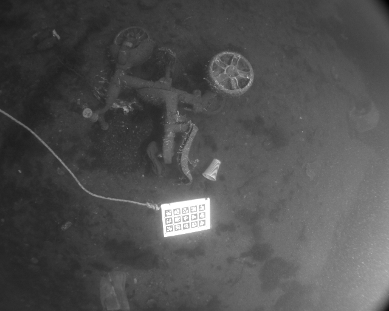
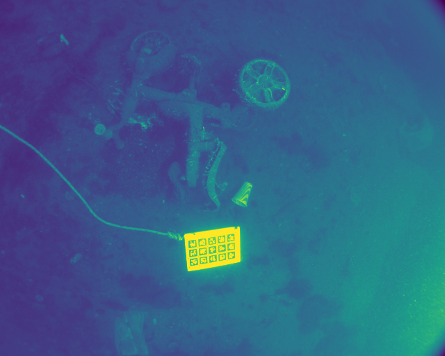
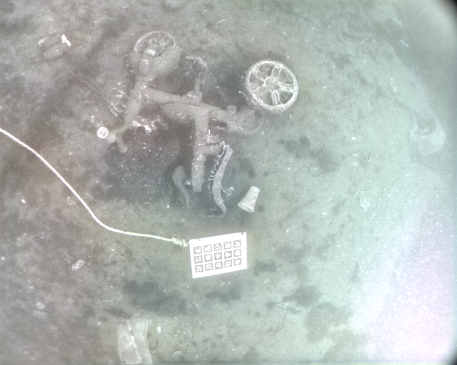
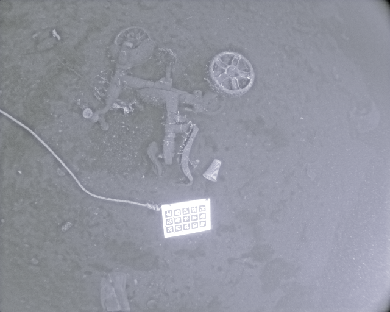
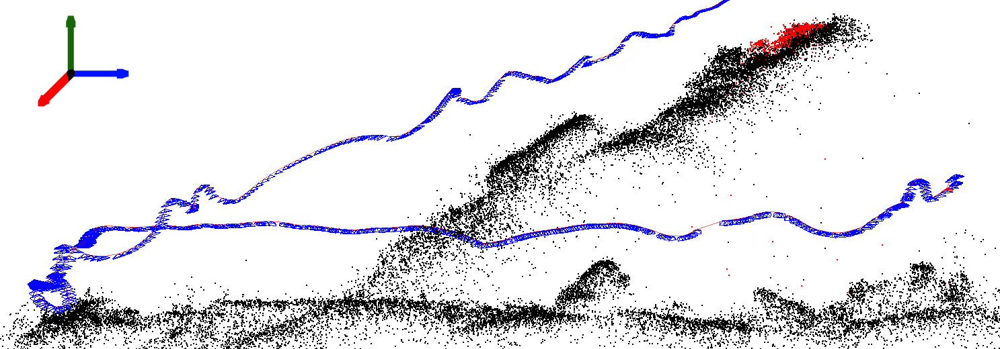

# Data Augmentation to Improve Underwater SLAM Performance

## Overview 
This repository contains our code for our final project for EECS 568: Mobile Robotics during the Winter 2024 Semester at the University of Michigan. Our team is made up of:
* Christopher Okumura (cokumura@umich.edu): ECE Master's student (Specialization: Robotics).
* Tiffany Parise (tparise@umich.edu): ECE Master's student (Specialization: Computer Vision).
* Daphne Tsai (dvtsai@umich.edu): CSE Master's student.

Our project enhances underwater SLAM performance using data augmentation techniques, focusing on brightness and contrast adjustments within the ORB-SLAM3 visual processing pipeline. Our approach addresses the unique challenges of underwater environments and provides a framework for other applications with compromised visual data.

## Relevant Links
* Paper
* Video: https://www.youtube.com/watch?v=VCBp90QouGk
* Presentation
* Poster

## Download the AQUALOC Dataset
The AQUALOC dataset can be found [here](https://www.lirmm.fr/aqualoc/). Please download the appropiate files. Our project uses data from the Harbor sequence, but you can take a look at the Archaelogical sequence of this dataset if you'd like. An example of an image that we will use for this project is as follows:



## Data Augmentation 
We will perform two data augmentations on the AQUALOC dataset: contrast and brightness. For the augmentations, the raw data files are downloaded from the Harbor sequences in the AQUALOC datatset, and the images folder is used. Below are the directions to perform the augmentations. It is recommended to set up a virtual environment for each of these tasks, such as Conda. Please see the Conda [documentation](https://docs.conda.io/en/latest/) for more information. Create a Conda environment as follows:
```
conda create -n <new_name>
conda activate <new_name>
```
where <new_name> is the name of your Conda environment. Remember to exit the environment after you are done as follows:
```
conda deactivate <new_name>
```

### Contrast
Please see the code for contrast.py. You will need to specify the command line arguments as follows:
- --imgDir: path to the image folder that contrast adjustment will be performed on.
- --imgContrast: the contrast factor to be applied to the images in --imgDir.
- --rgbPath: the path to the directory to store the RGB contrasted images.
- --bwPath: the path to the directory to store the grayscale contrasted images. 
An example command looks like:
```
python3 contrast.py -i /home/daphne/Data-Augmenting-For-Submerged-SLAM/image_augmentation/temp_folder -c 1.0 -r /home/daphne/Data-Augmenting-For-Submerged-SLAM/image_augmentation/contrast_images_rgb/ -b /home/daphne/Data-Augmenting-For-Submerged-SLAM/image_augmentation/contrast_images_bw/
```
If the program is running properly, you should be able to generate the grayscale and RGB contrasted images:




### Brightness
We will use two different deep learning models for brightness enhancement. The directions are as follows:

#### Model 1: EnlightenGAN
The original work of EnlightenGAN can be found [here](https://github.com/VITA-Group/EnlightenGAN).
##### Step 1: Activate the Conda environment
- Please see the instructions above.
##### Step 2: Install the EnlightenGAN inference wrapper [repository](https://github.com/arsenyinfo/EnlightenGAN-inference)
```
pip3 install git+https://github.com/arsenyinfo/EnlightenGAN-inference
```
##### Step 3: Run EnlightenGAN on AQUALOC
To run EnlightenGAN, please see the code for brightness.py. You will need to specify command line arguments as follows:
- --imgDir: path to the image folder that EnlightenGAN will be run on.
- --output: name of the output folder where EnlightenGAN will store results. 
An example command looks like:
```
python3 brightness.py -i /home/daphne/Data-Augmenting-For-Submerged-SLAM/image_augmentation/temp_folder -o /home/daphne/Data-Augmenting-For-Submerged-SLAM/image_augmentation/brightness_images
```
**Note:** You will need onnxruntime to use the EnlightenGAN inference wrapper, which relies on the use of CUDA. If you want to switch to the CPU, make sure to specify this as the execution provider in brightness.py:
```
model = EnlightenOnnxModel(providers = ["CPUExecutionProvider"])
```
If you leave the providers blank, the model will default to CUDA. 

If the program is running properly, you should be able to generate the brightened images:



#### Model 2: Zero-DCE
The original work of Zero-DCE can be found [here](https://github.com/Li-Chongyi/Zero-DCE). 
##### Step 1: Activate the Conda environment
There are different dependencies needed between EnlightenGAN and Zero-DCE. Therefore, it is recommended to have different environments for the two models to avoid any dependency conflicts. Please see the instructions above. 
##### Step 2: Clone the Zero-DCE [repository](https://github.com/Li-Chongyi/Zero-DCE)
```
git clone https://github.com/Li-Chongyi/Zero-DCE.git
```
##### Step 3: Run Zero-DCE on AQUALOC 
To run Zero-DCE, please see the code for brightness.py. You will need to specify command line arguments as follows:
- --imgDir: path to the image folder that Zero-DCE will be run on.
- --output: name of the output folder where Zero-DCE will store results. 
An example command looks like:
```
python3 brightness.py -i /home/daphne/Data-Augmenting-For-Submerged-SLAM/image_augmentation/temp_folder -o /home/daphne/Data-Augmenting-For-Submerged-SLAM/image_augmentation/brightness_images
```
**Note:** Zero-DCE was developed for RGB images. However, the images in the AQUALOC dataset are grayscale. Therefore, we modified the Zero-DCE code to take in grayscale images. 

If the program is running properly, you should be able to generate the brightened images:



## ORB-SLAM 3
Our team utilized ORB-SLAM3 to estimate the robot's trajectory because it is a general-use, highly-performant, modern visual SLAM algorithm that comes with a "pre-trained" Bag-of-Words model. The following explains the usage of ORB-SLAM3 with the Aqualoc Dataset

### Step 1: Installation of ORB-SLAM3
Please follow the installation instructions for ORB-SLAM3 in this repo's "ORB_SLAM3" folder's README.md. You will need to install multiple dependencies on your machine. It is also recommended to setup a virtual environment to run ORB-SLAM3 such as a Docker container. 

### Step 2: Build the ORB-SLAM3 programs via CMake
```
# First, navigate to the ORB_SLAM3 directory
cd ORB_SLAM3

# Create a build folder to store executables and build files
mkdir build

# Navigate to newly-created build
cd build

# Prepare the folder with CMake
cmake ..

# Make the programs outlined in the CMakeLists.txt
make
```

### Step 3: Provide Aqualoc Calibration Files
ORB-SLAM3 requires calibrations files to mathematically relate different sensor frames and rectify camera perspective. The Aqualoc dataset comes with pre-determined calibration parameters which are already implemented in the HarborStarter/visual/harbor_orb_slam.yaml and the HarborStarter/visual-inertial/harbor_orb_slam_inertial.yaml files. 

**Note:** HarborStarter/visual/harbor_orb_slam.yaml does not contain any IMU information because all files and executables in the HarborStarter/visual folder will rely only upon camera stream. The HarborStarter/visual-intertial folder builds upon this by sensor fusing IMU data, hence the folder name differences.

### Step 4: Run the ORB-SLAM3 program on Aqualoc datasets with visual-only data
The newly-create executable for running ORB-SLAM3 with Aqualoc visual-only data is located in the HarborStarter/visual folder. To run it you must do the following:
```
cd HarborStarter/visual
./harbor_camera [path-to-ORB-BOW-vocabulary] [.yaml calibration file path] [folder path where Aqualoc images contained] [.csv file outlining the sequence offile names for Aqualoc images] [desired name of output trajectory data]
```


Alternatively, a Shell file in the ORB_SLAM3 directory is provided for convenience. You will have to edit some of the arguments contained in the Shell script, particularly the file paths of where the Aqualoc data is contained.
Once the Shell script configuration is edited, start the ORB-SLAM3 application by doing the following:
```
cd ORB_SLAM3
./start_test.sh
```

### Step 5: Run the ORB-SLAM3 program on Aqualoc datasets with visual + inertial data
Similarily, the newly-create executable for running ORB-SLAM3 with Aqualoc visual + inertial data is located in the HarborStarter/visual-inertial folder. To run it you must do the following:
```
cd HarborStarter/visual-inertial
./harbor_camera_inertial [path-to-ORB-BOW-vocabulary] [.yaml calibration file path] [folder path where Aqualoc images contained] [.csv file outlining the sequence offile names for Aqualoc images] [.csv file's path containing the IMU data] [desired name of output trajectory data]
```


Alternatively, a Shell file in the ORB_SLAM3 directory is provided for convenience. You will have to edit some of the arguments contained in the Shell script, particularly the file paths of where the Aqualoc data is contained.
Once the Shell script configuration is edited, start the ORB-SLAM3 application by doing the following:
```
cd ORB_SLAM3
./start_visual-inertial.sh
```

### Example Output on the ORB-SLAM3 GUI
program is running properly, you should see points poIf the pulating a 3D map like the following:



## Evaluating Trajectory Estimation
This repository contains code to evaluate the quality of ORB-SLAM3's trajectory estimates compared to the ground-truth trajectory provided in the AQUALOC dataset. All relevant code is located in the notebook evaluation_metrics.ipynb in the Evaluation folder.

### Installing Required Packages
Please run the following code in your terminal to install the necessary packages:
```
pip install evo
pip install matplotlib
pip install numpy
```

### Procuring the Required Files
There are two required files:
1. A text file containing the ground-truth trajectory. This file is available in the AQUALOC dataset [here](https://seafile.lirmm.fr/d/79b03788f29148ca84e5/files/?p=%2FHarbor_sites_sequences%2Fharbor_groundtruth_files%2Fharbor_colmap_traj_sequence_01.txt).
2. A text file containing the estimated trajectory. This file is outputted by running ORB-SLAM3 on Harbor Sequence 01 in the AQUALOC dataset.

Both text files must be set up such that each row contains data in the order: ID, x, y, z, qx, qy, qz, qw. In this sequence, ID is the index number or timestep of the image, (x,y,z) is the camera position in the world frame, and (qz,qy,qz,qw) is a quaternion representing the camera orientation.

All of our evaluated text files are located in the Evaluation folder.

### Hyperparameter Tuning
The evaluation notebook includes a grid search to select the value of the hyperparameter representing the time offset. To help select an appropriate range of values for the grid search, there is code to plot the performance over different hyperparameter values. In addition, we provided a modified ground-truth file where the image index is replaced with the timestep, which allows for easier comparison with the timesteps in the trajectory estimate produced by ORB-SLAM3.

### Quantitative and Qualitative Evaluation Methods
The two main methods of evaluation are:
1. Quantitative evaluation: Report performance on many metrics (Root-Mean Square Error (RMSE), Sum of Squared Errors (SSE), Mean Error, Median Error, Standard Deviation of the Error, Minimum Error, and Maximum Error).
2. Qualitiative evaluation: Visualize the estimated and ground-truth trajectories in all three dimensions or in any selected two dimensions.

Both methods have settings that allow your evaluation to account for potential differences in scale and alignment between your estimated trajectory and the ground-truth trajectory. Further, your evaluation can consider the full transformation error of the trajectory, or just the error in the translational or rotational components of the trajectory.

